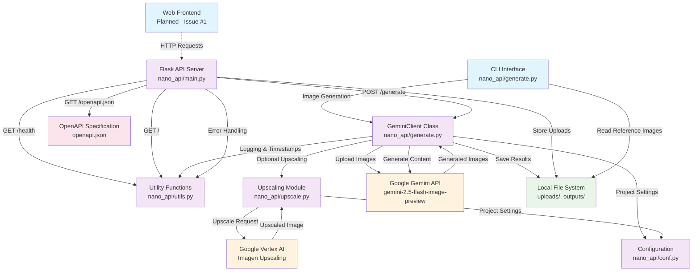

# NanoAPIClient System Architecture

This diagram shows the complete system architecture including all components, data flows, and external services.

## Component Details

### User Interfaces
- **CLI Interface** (`nano_api/generate.py`): Command-line tool with full parameter support
- **Web Frontend** (Planned): Modern web UI for image generation (GitLab Issue #1)

### Core Application Layer
- **Flask API Server** (`nano_api/main.py`): REST API with endpoints for generation, health, and documentation
- **GeminiClient Class** (`nano_api/generate.py`): Core logic for AI image generation
- **Utility Functions** (`nano_api/utils.py`): Shared utilities for timestamps, logging, error handling
- **Upscaling Module** (`nano_api/upscale.py`): Image upscaling using Vertex AI
- **Configuration** (`nano_api/conf.py`): Default project settings and constants

### External Services
- **Google Gemini API**: AI image generation using gemini-2.5-flash-image-preview model
- **Google Vertex AI**: Image upscaling using Imagen model (2x, 4x scaling)

### Data Flow
1. **Input**: Users provide prompts and reference images via CLI or API
2. **Processing**: Images uploaded to Gemini API, content generated
3. **Optional Upscaling**: Generated images processed through Vertex AI
4. **Output**: Final images saved to local filesystem with timestamps

### API Endpoints
- `POST /generate`: Main image generation with all CLI parameters
- `GET /health`: Service health check
- `GET /`: API information and endpoint documentation
- `GET /openapi.json`: Complete OpenAPI 3.0.3 specification

### Key Features
- **Multi-image Support**: Multiple reference images per generation
- **Parameter Flexibility**: Full CLI parameter support in API
- **Error Handling**: Comprehensive logging and user feedback
- **Security**: Environment-based configuration, secure file handling
- **Quality Assurance**: Comprehensive testing, linting, type checking
- **Documentation**: OpenAPI specification, API demo examples

### Technology Stack
- **Backend**: Python 3.10, Flask, Poetry dependency management
- **AI Services**: Google Gemini API, Google Vertex AI
- **Testing**: pytest (61 tests), comprehensive coverage
- **Quality Tools**: pylint, flake8, mypy, bandit
- **CI/CD**: GitLab CI/CD with automated quality gates
- **Documentation**: OpenAPI 3.0.3, Markdown documentation