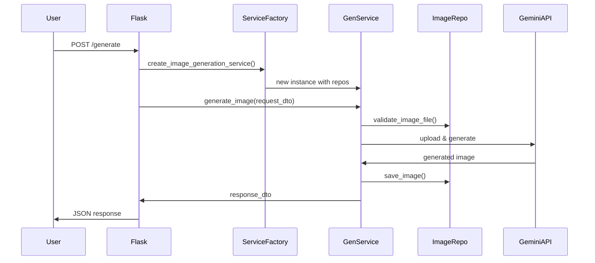
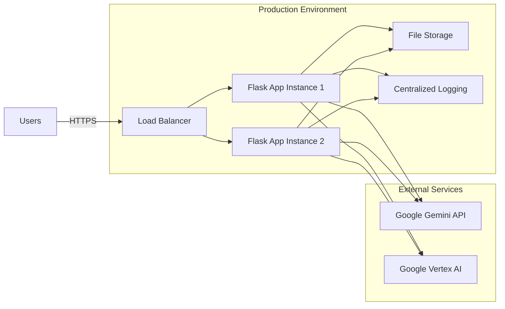

# stable-delusion System Architecture

This document describes the complete enterprise-grade system architecture with
clean architecture principles, comprehensive design patterns, and robust quality
assurance.

## System Overview

```mermaid
graph TB
    CLI["CLI Interface<br/>stable_delusion/generate.py"]
    WebUI["Web Frontend<br/>Planned - Issue #1"]
    Flask["Flask API Server<br/>stable_delusion/main.py"]

    subgraph ServiceLayer ["Service Layer"]
        GenService["Image Generation Service<br/>stable_delusion/services/gemini_service.py"]
        UpscaleService["Upscaling Service<br/>stable_delusion/services/upscaling_service.py"]
        FileService["File Service<br/>stable_delusion/services/file_service.py"]
    end

    subgraph FactoryLayer ["Factory Layer"]
        ServiceFactory["Service Factory<br/>stable_delusion/factories/service_factory.py"]
        RepoFactory["Repository Factory<br/>stable_delusion/factories/repository_factory.py"]
    end

    subgraph RepositoryLayer ["Repository Layer"]
        ImageRepo["Image Repository<br/>stable_delusion/repositories/local_image_repository.py"]
        FileRepo["File Repository<br/>stable_delusion/repositories/local_file_repository.py"]
        UploadRepo["Upload Repository<br/>stable_delusion/repositories/upload_repository.py"]
    end

    GeminiClient["GeminiClient Class<br/>stable_delusion/generate.py"]
    ConfigMgr["Configuration Manager<br/>stable_delusion/config.py"]

    subgraph ModelLayer ["Model Layer DTOs"]
        RequestModels["Request DTOs<br/>stable_delusion/models/requests.py"]
        ResponseModels["Response DTOs<br/>stable_delusion/models/responses.py"]
    end

    subgraph ExceptionLayer ["Exception Hierarchy"]
        Exceptions["Custom Exceptions<br/>stable_delusion/exceptions.py"]
    end

    GeminiAPI["Google Gemini API<br/>gemini-2.5-flash-image-preview"]
    VertexAI["Google Vertex AI<br/>Imagen Upscaling"]
    LocalFS["Local File System<br/>uploads/, outputs/"]
    OpenAPI["OpenAPI Specification<br/>openapi.json"]
    ConfigFiles["Environment Config<br/>.env, defaults"]

    CLI --> GeminiClient
    WebUI -.-> Flask
    Flask --> ServiceFactory
    ServiceFactory --> GenService
    ServiceFactory --> UpscaleService
    ServiceFactory --> FileService
    GenService --> RepoFactory
    FileService --> RepoFactory
    RepoFactory --> ImageRepo
    RepoFactory --> FileRepo
    RepoFactory --> UploadRepo

    GenService --> GeminiClient
    GenService --> ImageRepo
    FileService --> ImageRepo
    FileService --> FileRepo
    UpscaleService --> VertexAI

    Flask --> RequestModels
    Flask --> ResponseModels
    GenService --> RequestModels
    GenService --> ResponseModels
    Flask --> Exceptions
    GenService --> Exceptions

    GeminiClient --> GeminiAPI
    ImageRepo --> LocalFS
    FileRepo --> LocalFS
    UploadRepo --> LocalFS
    ConfigMgr --> ConfigFiles
    Flask --> OpenAPI

    classDef userInterface fill:#e1f5fe
    classDef apiLayer fill:#f8bbd9
    classDef serviceLayer fill:#f3e5f5
    classDef factoryLayer fill:#fff9c4
    classDef repositoryLayer fill:#c8e6c9
    classDef modelLayer fill:#ffecb3
    classDef exceptionLayer fill:#ffcdd2
    classDef coreModule fill:#e8eaf6
    classDef externalAPI fill:#fff3e0
    classDef storage fill:#e8f5e8
    classDef documentation fill:#fce4ec

    class CLI,WebUI userInterface
    class Flask apiLayer
    class GenService,UpscaleService,FileService serviceLayer
    class ServiceFactory,RepoFactory factoryLayer
    class ImageRepo,FileRepo,UploadRepo repositoryLayer
    class RequestModels,ResponseModels modelLayer
    class Exceptions exceptionLayer
    class GeminiClient,ConfigMgr coreModule
    class GeminiAPI,VertexAI externalAPI
    class LocalFS,ConfigFiles storage
    class OpenAPI documentation
```



## Architecture Layers

### 1. **User Interface Layer**
- **CLI Interface**: Command-line tool with comprehensive parameter support
- **Web API**: RESTful Flask server with OpenAPI documentation
- **Future Web UI**: Modern frontend (planned)

### 2. **API Layer**
- **Flask Application** (`stable_delusion/main.py`): HTTP server with endpoints
- **Route Handlers**: Request validation, response formatting
- **Middleware**: Error handling, logging, security

### 3. **Service Layer** (Business Logic)
- **Image Generation Service**: Orchestrates AI image creation workflow
- **Upscaling Service**: Manages image upscaling operations
- **File Service**: Handles file operations with validation
- **Clean Interface Contracts**: Abstract base classes for all services

### 4. **Factory Layer** (Object Creation)
- **Service Factory**: Centralized service instantiation with dependencies
- **Repository Factory**: Repository creation and configuration
- **Dependency Injection**: Automatic resolution of service dependencies

### 5. **Repository Layer** (Data Persistence)
- **Image Repository**: PIL image operations with error handling
- **File Repository**: Generic file system operations
- **Upload Repository**: Secure file upload handling with validation
- **Abstract Interfaces**: Repository contracts for future implementations

### 6. **Model Layer** (Data Transfer Objects)
- **Request DTOs**: Structured input validation and parsing
- **Response DTOs**: Consistent output formatting
- **Type Safety**: Full type annotations with validation

### 7. **Exception Hierarchy**
- **Custom Exception Classes**: Domain-specific error types
- **Exception Chaining**: Proper error context preservation
- **Structured Error Handling**: Consistent error responses

## Design Patterns Implemented

### **🏗️ Service Layer Pattern**
```python
# Clean business logic separation
class GeminiImageGenerationService(ImageGenerationService):
    def generate_image(self, request: GenerateImageRequest) -> GenerateImageResponse:
        # Orchestrates the complete generation workflow
```

### **🗄️ Repository Pattern**
```python
# Data persistence abstraction
class LocalImageRepository(ImageRepository):
    def save_image(self, image: Image.Image, file_path: Path) -> Path:
        # Handles all image persistence logic
```

### **🏭 Factory Pattern**
```python
# Centralized object creation with dependency injection
class ServiceFactory:
    @staticmethod
    def create_image_generation_service() -> ImageGenerationService:
        # Creates services with all required dependencies
```

### **📋 Data Transfer Object (DTO) Pattern**
```python
# Structured API contracts
@dataclass
class GenerateImageRequest:
    prompt: str
    images: List[Path]
    scale: Optional[float] = None
```

### **⚙️ Configuration Management Pattern**
```python
# Environment-based configuration with validation
class ConfigManager:
    @classmethod
    def get_config(cls) -> Config:
        # Singleton pattern with environment variable support
```

## Quality Assurance Framework

### **Testing Strategy**
- **375 Total Tests** with 100% pass rate
- **Unit Tests**: Individual component validation
- **Integration Tests**: End-to-end workflow testing
- **Factory Tests**: Dependency injection validation
- **Repository Tests**: Data persistence verification
- **S3 Integration Tests**: AWS S3 storage backend testing
- **Metadata Tests**: Generation metadata and deduplication testing

### **Code Quality Tools**
- **PyLint**: 9.92/10 code quality score
- **Flake8**: PEP8 compliance checking
- **MyPy**: Complete type checking coverage
- **Bandit**: Security vulnerability scanning

### **Architecture Compliance**
- **SOLID Principles**: Single Responsibility, Open/Closed, etc.
- **Clean Architecture**: Proper dependency directions
- **Interface Segregation**: Focused, minimal interfaces
- **Dependency Inversion**: Abstractions over concretions

## API Endpoints

| Endpoint | Method | Description | Request/Response |
|----------|--------|-------------|------------------|
| `/generate` | POST | Image generation | `GenerateImageRequest` → `GenerateImageResponse` |
| `/health` | GET | Service health check | → `HealthResponse` |
| `/` | GET | API information | → `APIInfoResponse` |
| `/openapi.json` | GET | OpenAPI specification | → JSON Schema |

## Data Flow Architecture



## Security Features

- **Input Validation**: Comprehensive request validation with DTOs
- **File Security**: Secure filename generation and path validation
- **Upload Safety**: Content type verification and size limits
- **Configuration Security**: Environment-based secrets management
- **Error Handling**: Secure error responses without information leakage

## Performance Optimizations

- **Factory Pattern**: Efficient object creation and reuse
- **Repository Caching**: Optimized file operations
- **Lazy Loading**: Services created on-demand
- **Connection Pooling**: Efficient API client management
- **File Cleanup**: Automated cleanup of temporary files

## Extensibility Points

- **New AI Providers**: Implement `ImageGenerationService` interface
- **Storage Backends**: Implement repository interfaces for cloud storage
- **Authentication**: Add middleware for user authentication
- **Caching Layer**: Add Redis/memory caching repositories
- **Message Queues**: Add async processing capabilities

## Technology Stack

### **Backend Framework**
- **Python 3.10+**: Modern Python with type hints
- **Flask**: Lightweight WSGI web framework
- **Poetry**: Advanced dependency management

### **AI/ML Services**
- **Google Gemini API**: Advanced AI image generation
- **Google Vertex AI**: Professional image upscaling
- **PIL/Pillow**: Image processing and manipulation

### **Quality Assurance**
- **pytest**: Advanced testing framework with fixtures
- **pylint**: Comprehensive code quality analysis
- **flake8**: PEP8 and style checking
- **mypy**: Static type checking
- **bandit**: Security vulnerability scanning

### **Development Tools**
- **Pre-commit Hooks**: Automated code quality enforcement
- **Type Annotations**: Complete type safety coverage
- **Logging**: Structured application logging
- **Configuration**: Environment-based configuration management

## Deployment Architecture



## Future Enhancements

- **Microservices Architecture**: Break services into independent deployments
- **Event-Driven Architecture**: Add message queues for async processing
- **Database Integration**: Add PostgreSQL for metadata storage
- **Caching Layer**: Redis for performance optimization
- **Authentication**: OAuth2/JWT implementation
- **Monitoring**: Prometheus/Grafana observability stack
- **Container Deployment**: Docker and Kubernetes support